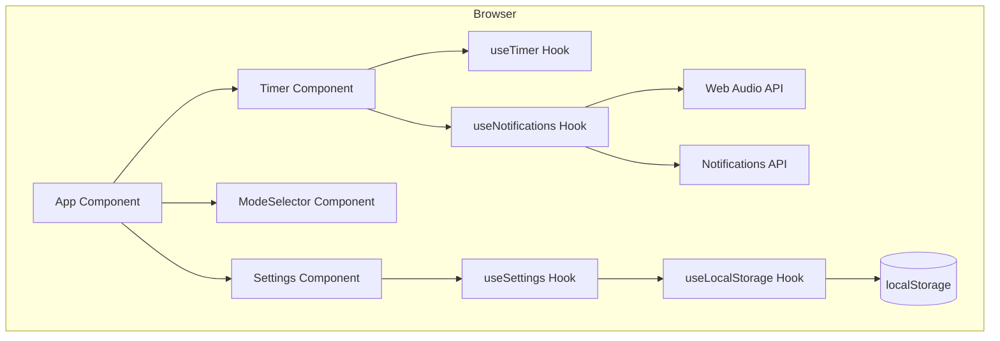
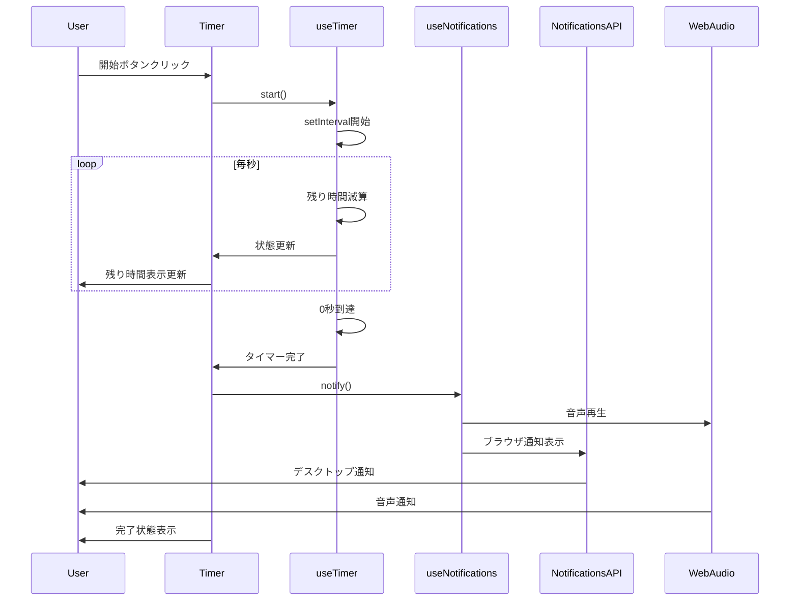
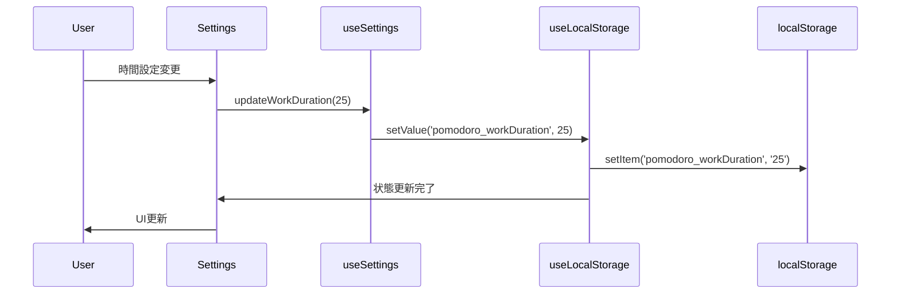

# Design Document

## Overview

本設計は、React + TypeScript + Viteを使用したポモドーロタイマーWebアプリケーションの技術仕様を定義します。このアプリケーションは、ポモドーロテクニックを実践するユーザーに対して、タイマー管理、カスタマイズ可能な設定、通知機能を提供します。

**Purpose**: 集中作業と休憩を効果的に管理できるシンプルで直感的なポモドーロタイマーを提供し、ユーザーの生産性向上を支援する。

**Users**: ポモドーロテクニックを実践する個人ユーザー（学生、リモートワーカー、フリーランサー等）が、作業時間と休憩時間の管理、設定のカスタマイズ、タイマー完了通知の受信に利用する。

**Impact**: 新規アプリケーションのため既存システムへの影響はない。ユーザーはブラウザでアクセスし、設定はブラウザのローカルストレージに保存される。

### Goals

- ポモドーロテクニックの基本サイクル（作業25分 + 休憩5分）を簡単に実行できる
- ユーザーの好みに合わせて作業時間と休憩時間をカスタマイズ可能
- タイマー完了時に音声通知とブラウザ通知で確実にユーザーに通知
- シングルページアプリケーションとしてモバイル・デスクトップ両対応
- ユーザー設定を永続化し、再訪問時も快適に使用可能

### Non-Goals

- ポモドーロ完了数の統計・履歴機能（将来の拡張で検討）
- 複数デバイス間での設定同期（サーバー不要の方針）
- タスク管理機能（タイマーに特化）
- ユーザー認証・アカウント機能（個人用ローカルアプリ）
- 長期休憩（Long Break）の自動管理（初期バージョンでは手動切り替え）

## Architecture

### Architecture Pattern & Boundary Map

**選択パターン**: React Hooksベースのコンポーネント中心アーキテクチャ

本アプリケーションは小規模なSPAであり、複雑なドメインロジックや外部システム統合を必要としないため、Reactの標準的なHooksパターンを採用します。カスタムフックでロジックを分離し、コンポーネントはプレゼンテーションに専念します。



**Architecture Integration**:
- **選択パターン**: React Hooks中心のコンポーネント設計。小規模アプリに最適で、学習コスト低く保守性高い。
- **Domain/feature boundaries**:
  - UI層: Timer, ModeSelector, Settings（プレゼンテーション責任）
  - ロジック層: useTimer, useSettings, useNotifications（ビジネスロジック責任）
  - 永続化層: useLocalStorage（データ永続化責任）
- **Existing patterns preserved**: N/A（新規アプリ）
- **New components rationale**:
  - カスタムフックでロジックを分離し、テスタビリティと再利用性を確保
  - コンポーネントは状態管理をフックに委譲し、UIレンダリングに専念
- **Steering compliance**: ステアリングコンテキストなし（プロジェクト初期）

### Technology Stack

| Layer | Choice / Version | Role in Feature | Notes |
|-------|------------------|-----------------|-------|
| Frontend / CLI | React 18+ | UIレンダリング、コンポーネント管理 | Hooksベースの関数コンポーネント |
| Frontend / CLI | TypeScript 5+ | 型安全性、開発者体験向上 | strictモード有効、anyの使用禁止 |
| Frontend / CLI | Vite 5+ | ビルドツール、開発サーバー | 高速なHMR、最適化されたプロダクションビルド |
| Frontend / CLI | Material-UI (MUI) 5+ | UIコンポーネントライブラリ | Material Designガイドライン準拠、Emotion CSS-in-JS、アイコン、テーマ機能 |
| Frontend / CLI | Emotion | CSS-in-JS | MUIの依存、動的スタイリング、テーマ統合 |
| Data / Storage | localStorage | ユーザー設定の永続化 | ブラウザ標準API、5-10MB容量 |
| Messaging / Events | Web Notifications API | タイマー完了通知 | HTTPS必須、ユーザー許可必要 |
| Infrastructure / Runtime | Web Audio API | 音声通知再生 | ブラウザ標準API、Oscillatorでビープ音生成（600Hz sine wave、0.3秒、音量30%） |

詳細な技術選定の根拠は`research.md`を参照。

## System Flows

### タイマー実行フロー



**Key Decisions**:
- タイマー精度: `setInterval`の累積誤差を防ぐため、`Date.now()`ベースの経過時間計算を使用（100ms間隔で更新）
- Pause/Resume対応: 一時停止からの再開時、既経過時間を考慮した`startTime`を計算（`Date.now() - (totalDuration - remainingTime) * 1000`）
- 通知順序: 音声通知とブラウザ通知は並列実行（どちらかが失敗しても影響しない）
- 通知トリガー: `hasEverRun`フラグで実際にタイマーが実行された後の完了時のみ通知（リロード時や設定クリア時の誤通知を防止）

### 設定保存フロー



**Key Decisions**:
- 即座保存: ユーザー操作後すぐにlocalStorageへ保存（デバウンス不要）
- 個別キー管理: 各設定を独立したキーで管理し、部分的な保存・復元を可能にする

## Requirements Traceability

| Requirement | Summary | Components | Interfaces | Flows |
|-------------|---------|------------|------------|-------|
| 1.1 | タイマー開始 | Timer, useTimer | TimerState, TimerActions | タイマー実行フロー |
| 1.2 | タイマー停止 | Timer, useTimer | TimerState, TimerActions | タイマー実行フロー |
| 1.3 | タイマーリセット | Timer, useTimer | TimerState, TimerActions | - |
| 1.4 | タイマー完了検出 | useTimer, useNotifications | TimerState, NotificationService | タイマー実行フロー |
| 1.5 | 1秒ごとの更新表示 | Timer, useTimer | TimerState | タイマー実行フロー |
| 1.6 | 分:秒形式表示 | Timer | TimerState | - |
| 2.1 | 作業・休憩モード提供 | ModeSelector, useTimer | TimerMode | - |
| 2.2 | 作業モード選択 | ModeSelector, useTimer | TimerMode, TimerActions | - |
| 2.3 | 休憩モード選択 | ModeSelector, useTimer | TimerMode, TimerActions | - |
| 2.4 | モード切り替え提案 | Timer, useTimer | TimerState, TimerMode | タイマー実行フロー |
| 2.5 | モード視覚的区別 | ModeSelector, Timer | TimerMode | - |
| 3.1 | 作業時間設定範囲 | Settings, useSettings | SettingsState, SettingsValidation | - |
| 3.2 | 休憩時間設定範囲 | Settings, useSettings | SettingsState, SettingsValidation | - |
| 3.3 | 設定変更時保存 | Settings, useSettings, useLocalStorage | SettingsState, LocalStorageService | 設定保存フロー |
| 3.4 | 再起動時設定復元 | App, useSettings, useLocalStorage | SettingsState, LocalStorageService | - |
| 3.5 | デフォルト設定 | useSettings | SettingsState | - |
| 3.6 | 設定画面表示 | Settings, useSettings | SettingsState | - |
| 4.1 | 音声通知再生 | useNotifications | NotificationService | タイマー実行フロー |
| 4.2 | ブラウザ通知表示 | useNotifications | NotificationService | タイマー実行フロー |
| 4.3 | 通知許可リクエスト | App, useNotifications | NotificationService | - |
| 4.4 | 通知拒否時フォールバック | useNotifications | NotificationService | タイマー実行フロー |
| 4.5 | 音声通知ON/OFF | Settings, useSettings | SettingsState | - |
| 4.6 | 音声設定保存 | Settings, useSettings, useLocalStorage | SettingsState, LocalStorageService | 設定保存フロー |
| 5.1 | SPA動作 | App | - | - |
| 5.2 | レスポンシブデザイン | 全コンポーネント | - | - |
| 5.3 | ボタン常時表示 | Timer | TimerActions | - |
| 5.4 | 動作中の停止ボタン強調 | Timer | TimerState | - |
| 5.5 | 停止中の開始ボタン強調 | Timer | TimerState | - |
| 5.6 | 設定画面アクセス | App, Settings | - | - |
| 6.1 | 個別キー保存 | useLocalStorage | LocalStorageService | 設定保存フロー |
| 6.2 | 個別キー管理 | useLocalStorage | LocalStorageService | - |
| 6.3 | 起動時設定読込 | useSettings, useLocalStorage | SettingsState, LocalStorageService | - |
| 6.4 | デフォルト設定フォールバック | useSettings | SettingsState | - |
| 6.5 | タイマー状態非保存 | useTimer | TimerState | - |

## Components and Interfaces

### Component Summary

| Component | Domain/Layer | Intent | Req Coverage | Key Dependencies (P0/P1) | Contracts |
|-----------|--------------|--------|--------------|--------------------------|-----------|
| App | UI/Container | アプリ全体の構成管理 | 3.4, 4.3, 5.1, 5.6 | useSettings (P0), useNotifications (P0) | State |
| Timer | UI/Presentation | タイマー表示と制御 | 1.1-1.6, 2.4, 2.5, 5.3-5.5 | useTimer (P0), useNotifications (P0) | State |
| ModeSelector | UI/Presentation | 作業/休憩モード切替 | 2.1-2.3, 2.5 | useTimer (P0) | State |
| Settings | UI/Presentation | 設定UI | 3.1, 3.2, 3.6, 4.5 | useSettings (P0) | State |
| useTimer | Logic/Hook | タイマーロジック | 1.1-1.6, 2.1-2.4, 6.5 | useSettings (P1) | Service |
| useSettings | Logic/Hook | 設定管理 | 3.1-3.6, 4.5, 4.6, 6.3-6.4 | useLocalStorage (P0) | Service |
| useNotifications | Logic/Hook | 通知管理 | 4.1-4.4 | useSettings (P1) | Service |
| useLocalStorage | Logic/Hook | localStorage統合 | 3.3, 3.4, 4.6, 6.1-6.3 | なし | Service |

### UI Layer

#### App

| Field | Detail |
|-------|--------|
| Intent | アプリケーション全体のルートコンポーネント、初期化処理を担当 |
| Requirements | 3.4, 4.3, 5.1, 5.6 |

**Responsibilities & Constraints**
- アプリ全体のレイアウトと子コンポーネントの配置
- 初期化処理（設定読み込み、通知許可リクエスト）
- ルーティングなし（SPA単一画面）

**Dependencies**
- Outbound: useSettings — 設定初期化と読み込み (P0)
- Outbound: useNotifications — 通知許可リクエスト (P0)

**Contracts**: State [x]

##### State Management
- State model: Appコンポーネント自体は状態を持たず、子コンポーネントに伝播
- Persistence & consistency: N/A
- Concurrency strategy: N/A

**Implementation Notes**
- Integration: Timer, ModeSelector, Settingsコンポーネントをレイアウト
- Validation:
  - 初回ロード時にuseEffect内で通知許可リクエストを実行
  - 設定値の検証（`typeof workDuration === 'number' && workDuration >= 1`）を実施
  - 無効な設定（空文字列または0）の場合、タイマーに0を渡し、disabledフラグをtrueに設定
- Risks: なし

#### Timer

| Field | Detail |
|-------|--------|
| Intent | タイマーの表示、開始/停止/リセットボタンの提供 |
| Requirements | 1.1-1.6, 2.4, 2.5, 5.3-5.5 |

**Responsibilities & Constraints**
- 残り時間を分:秒形式で表示
- 開始/停止/リセットボタンの提供と状態に応じた強調表示
- タイマー完了時に通知をトリガー
- モード（作業/休憩）を視覚的に区別
- 無効な設定時にボタンを無効化（disabled prop経由）

**Dependencies**
- Outbound: useTimer — タイマー状態とアクション取得 (P0)
- Outbound: useNotifications — 完了時通知 (P0)

**Contracts**: State [x]

##### State Management
- State model: useTimerフックから受け取る状態（remainingTime, isRunning, mode）と親コンポーネントからのdisabledフラグ
- Persistence & consistency: ローカルコンポーネント状態、永続化なし
- Concurrency strategy: N/A

**Implementation Notes**
- Integration: useTimerフックでタイマーロジックを管理、UIは表示とボタン制御のみ
- Validation: ボタンクリックハンドラーでアクションを呼び出し。disabledプロップが真の場合、開始/リセットボタンを無効化
- Notification Trigger: `hasEverRun`フラグパターンを使用し、実際にタイマーが実行された後の完了時のみ通知を送信（リロード時やクリア時の誤通知を防止）
- Risks: タイマー完了時の通知失敗（音声/ブラウザ通知の許可状態に依存）

#### ModeSelector

| Field | Detail |
|-------|--------|
| Intent | 作業モードと休憩モードの切り替えUI |
| Requirements | 2.1-2.3, 2.5 |

**Responsibilities & Constraints**
- 作業/休憩モード選択ボタンの提供
- 現在のモードを視覚的に表示（アクティブボタンの強調）
- モード切り替え時にタイマーを初期化

**Dependencies**
- Outbound: useTimer — モード状態とモード切り替えアクション (P0)

**Contracts**: State [x]

##### State Management
- State model: useTimerフックから受け取るmode状態
- Persistence & consistency: ローカルコンポーネント状態、永続化なし
- Concurrency strategy: N/A

**Implementation Notes**
- Integration: useTimerのsetModeアクションを呼び出し
- Validation: モード切り替え時にタイマーリセット確認（実行中の場合）
- Risks: なし

#### Settings

| Field | Detail |
|-------|--------|
| Intent | 作業時間、休憩時間、音声通知のオン/オフ設定UI |
| Requirements | 3.1, 3.2, 3.6, 4.5 |

**Responsibilities & Constraints**
- 作業時間（1-60分）と休憩時間（1-30分）の入力フィールド
- 音声通知のオン/オフトグル
- 入力バリデーション（範囲チェック）
- 変更時の即座保存（useSettingsフック経由）
- 空文字列入力を許容し、1桁の数値削除を可能にする

**Dependencies**
- Outbound: useSettings — 設定状態と更新アクション (P0)

**Contracts**: State [x]

##### State Management
- State model: useSettingsフックから受け取る設定状態（workDuration, breakDuration, soundEnabled）
- Persistence & consistency: useLocalStorageフック経由でlocalStorageに永続化
- Concurrency strategy: N/A

**Implementation Notes**
- Integration: useSettingsのupdateアクションで設定更新とlocalStorage保存を同時実行
- Validation: 入力フィールドでmin/max属性を使用し範囲を強制、onChange時にバリデーション。空文字列（`value === ''`）を許容し、`number | ''`型で処理
- Empty Input Handling: ユーザーが数値を全削除できるよう、空文字列を`number | ''`型で管理
- Risks: 無効な値の入力（バリデーションで防止）

### Logic Layer

#### useTimer

| Field | Detail |
|-------|--------|
| Intent | タイマーロジック（カウントダウン、開始/停止/リセット、モード管理）を提供 |
| Requirements | 1.1-1.6, 2.1-2.4, 6.5 |

**Responsibilities & Constraints**
- タイマー状態管理（remainingTime, isRunning, mode）
- カウントダウンロジック（setIntervalベース、Date.now()で精度確保）
- 開始/停止/リセットアクション提供
- モード切り替えとタイマー初期化
- タイマー完了時のコールバック実行
- タイマー実行中状態は永続化しない（常にリセット状態で起動）

**Dependencies**
- Outbound: useSettings — 作業時間/休憩時間のデフォルト値取得 (P1)

**Contracts**: Service [x] / State [x]

##### Service Interface
```typescript
interface UseTimerReturn {
  // State
  remainingTime: number; // 残り時間（秒）
  isRunning: boolean; // タイマー実行中フラグ
  mode: TimerMode; // 現在のモード

  // Actions
  start: () => void;
  pause: () => void;
  reset: () => void;
  setMode: (mode: TimerMode) => void;
}

type TimerMode = 'work' | 'break';

interface TimerState {
  remainingTime: number;
  isRunning: boolean;
  mode: TimerMode;
  startTime: number | null; // カウントダウン開始時のタイムスタンプ
}
```

- Preconditions: useSettingsフックで設定が初期化されていること
- Postconditions: タイマー完了時にonCompleteコールバックが呼ばれること
- Invariants: remainingTimeは常に0以上、isRunning中はstartTimeがnullでない

##### State Management
- State model: useStateで管理するTimerState
- Persistence & consistency: 永続化なし（要件6.5）
- Concurrency strategy: setIntervalのクリーンアップをuseEffectで管理

**Implementation Notes**
- Integration: useEffectでisRunningとstartTimeを監視し、setIntervalを制御
- Validation: Date.now()ベースの経過時間計算でsetIntervalのドリフトを防止
- Timer Accuracy Improvements:
  - `start()`関数でpause/resume対応: `Date.now() - (getInitialTime(prev.mode) - prev.remainingTime) * 1000`により、一時停止からの再開時も正確な経過時間を保持
  - Interval: 100msで更新し、滑らかな表示を実現
  - Countdown logic: `totalDuration`（モードの初期時間）から経過時間を引いて残り時間を計算
  - Dependency optimization: `remainingTime`を依存配列から除外し、不要なinterval再作成を防止
- Risks: ブラウザタブが非アクティブ時のsetInterval遅延（Date.now()で補正）

#### useSettings

| Field | Detail |
|-------|--------|
| Intent | ユーザー設定の管理とlocalStorageへの永続化 |
| Requirements | 3.1-3.6, 4.5, 4.6, 6.3-6.4 |

**Responsibilities & Constraints**
- 設定状態管理（workDuration, breakDuration, soundEnabled）
- デフォルト値提供（作業25分、休憩5分、音声ON）
- 設定更新アクション提供
- localStorage統合（個別キー管理）
- バリデーション（作業1-60分、休憩1-30分）

**Dependencies**
- Outbound: useLocalStorage — localStorage読み書き (P0)

**Contracts**: Service [x] / State [x]

##### Service Interface
```typescript
interface UseSettingsReturn {
  // State
  workDuration: number | ''; // 作業時間（分）、空文字列は未入力状態
  breakDuration: number | ''; // 休憩時間（分）、空文字列は未入力状態
  soundEnabled: boolean; // 音声通知有効フラグ

  // Actions
  updateWorkDuration: (minutes: number | '') => void;
  updateBreakDuration: (minutes: number | '') => void;
  toggleSound: () => void;
}

interface SettingsState {
  workDuration: number | ''; // 空文字列を許容（入力中の削除対応）
  breakDuration: number | ''; // 空文字列を許容（入力中の削除対応）
  soundEnabled: boolean;
}

interface SettingsValidation {
  validateWorkDuration: (value: number) => boolean; // 1-60分
  validateBreakDuration: (value: number) => boolean; // 1-30分
}

const DEFAULT_SETTINGS: SettingsState = {
  workDuration: 25,
  breakDuration: 5,
  soundEnabled: true
};
```

- Preconditions: なし（デフォルト値で初期化可能）
- Postconditions: 設定更新時に即座にlocalStorageへ保存
- Invariants: workDurationは1-60（または空文字列）、breakDurationは1-30（または空文字列）の範囲内

##### State Management
- State model: useLocalStorageフックで個別キー管理（pomodoro_workDuration, pomodoro_breakDuration, pomodoro_soundEnabled）
- Persistence & consistency: 変更時に即座保存、起動時に自動読み込み
- Concurrency strategy: N/A

**Implementation Notes**
- Integration: useLocalStorageフックを3回呼び出し、各設定を個別管理
- Validation: updateアクション内でバリデーション実行、無効値は拒否。空文字列は許容し、1以上の数値のみ有効として扱う
- Empty State Handling: 空文字列の場合はタイマーを0分（00:00表示）とし、開始/リセットボタンを無効化
- Risks: localStorage容量制限（現実的には問題なし、数KB程度）

#### useNotifications

| Field | Detail |
|-------|--------|
| Intent | 音声通知とブラウザ通知の管理 |
| Requirements | 4.1-4.4 |

**Responsibilities & Constraints**
- ブラウザ通知許可のリクエスト
- タイマー完了時の音声通知再生
- タイマー完了時のブラウザ通知表示
- 通知許可状態の管理
- 通知拒否時のフォールバック（音声のみ）

**Dependencies**
- Outbound: useSettings — soundEnabled設定取得 (P1)
- External: Web Notifications API — ブラウザ通知 (P0)
- External: Web Audio API — 音声再生 (P0)

**Contracts**: Service [x]

##### Service Interface
```typescript
interface UseNotificationsReturn {
  // State
  permission: NotificationPermission; // 'default' | 'granted' | 'denied'

  // Actions
  requestPermission: () => Promise<NotificationPermission>;
  notify: (title: string, body: string) => void;
}

interface NotificationService {
  playSound: () => void;
  showBrowserNotification: (title: string, body: string) => void;
}

// 音声通知の詳細仕様
interface BeepSoundConfig {
  type: OscillatorType; // 'sine' - 柔らかい音
  frequency: number; // 600Hz - 中程度の高さ
  duration: number; // 0.3秒
  volume: number; // 0.3 (30%)
}

const BEEP_CONFIG: BeepSoundConfig = {
  type: 'sine',
  frequency: 600,
  duration: 0.3,
  volume: 0.3
};
```

- Preconditions:
  - requestPermissionはユーザージェスチャー後に呼び出すこと
  - HTTPS環境で動作すること
- Postconditions:
  - soundEnabledがtrueの場合、音声が再生される
  - permissionが'granted'の場合、ブラウザ通知が表示される
- Invariants: 音声通知は常に試行（soundEnabled=trueの場合）、ブラウザ通知は許可時のみ試行

**Implementation Notes**
- Integration:
  - 初回アクセス時にApp内でrequestPermissionを呼び出し
  - **音声通知**: Web Audio APIのOscillatorで生成（外部ファイル不要）
    - 正弦波（sine wave）、600Hz、0.3秒、音量30%のビープ音
    - AudioContextとOscillatorNodeを使用してコードで音を生成
  - **ブラウザ通知**: Notification APIでデスクトップ通知を表示
- Validation:
  - permissionステートを監視し、拒否時はブラウザ通知をスキップ
  - soundEnabledがfalseの場合、音声再生をスキップ
  - AudioContextの初期化エラーをtry-catchでハンドリング
- Risks:
  - iOS Safariでホーム画面未追加の場合、ブラウザ通知が動作しない
  - プライベートモード/シークレットモードでの通知制限
  - AudioContextの初期化にユーザージェスチャーが必要な場合あり（初回再生時に対応）

### Persistence Layer

#### useLocalStorage

| Field | Detail |
|-------|--------|
| Intent | localStorage統合のための型安全なカスタムフック |
| Requirements | 3.3, 3.4, 4.6, 6.1-6.3 |

**Responsibilities & Constraints**
- TypeScriptジェネリクスで型安全な読み書き
- JSON.stringify/parseによるシリアライゼーション
- エラーハンドリング（try-catch）
- デフォルト値のフォールバック
- SSR対応（window未定義チェック）

**Dependencies**
- External: localStorage API — ブラウザ標準API (P0)

**Contracts**: Service [x]

##### Service Interface
```typescript
interface UseLocalStorageReturn<T> {
  value: T;
  setValue: (newValue: T | ((prevValue: T) => T)) => void;
  removeValue: () => void;
}

function useLocalStorage<T>(
  key: string,
  defaultValue: T
): UseLocalStorageReturn<T>;

interface LocalStorageService {
  getItem: <T>(key: string, defaultValue: T) => T;
  setItem: <T>(key: string, value: T) => void;
  removeItem: (key: string) => void;
}
```

- Preconditions: keyは一意であること、defaultValueは有効なJSON型であること
- Postconditions: setValueでlocalStorageへ即座保存、getItemでデフォルト値またはlocalStorage値を返す
- Invariants: localStorageアクセスエラー時はデフォルト値を返す

**Implementation Notes**
- Integration:
  - useStateとuseEffectを組み合わせてlocalStorageと同期
  - setValueでJSON.stringifyしてlocalStorage.setItem
  - 初期化時にlocalStorage.getItemでJSON.parse、エラー時はdefaultValue使用
- Validation:
  - try-catchでlocalStorageアクセスエラーをハンドリング
  - window未定義チェックでSSR対応
- Risks:
  - localStorage容量超過（QuotaExceededError）
  - JSON.parseエラー（不正なデータ）
  - ブラウザのlocalStorage無効設定

## Data Models

### Domain Model

本アプリケーションのドメインモデルは3つの主要な集約で構成されます。

**Timer Aggregate**:
- Entities: Timer（タイマー状態）
- Value Objects: TimerMode（'work' | 'break'）、RemainingTime（残り時間）
- Domain Events: TimerStarted, TimerPaused, TimerReset, TimerCompleted
- Business Rules:
  - タイマーは0秒未満にならない
  - 実行中のタイマーのみ停止可能
  - モード切り替え時はタイマーリセット

**Settings Aggregate**:
- Entities: Settings（設定）
- Value Objects: WorkDuration（1-60分または空文字列）、BreakDuration（1-30分または空文字列）、SoundEnabled（boolean）
- Domain Events: SettingsUpdated
- Business Rules:
  - 作業時間は1-60分の範囲内、または空文字列（未入力状態）
  - 休憩時間は1-30分の範囲内、または空文字列（未入力状態）
  - 空文字列の場合、タイマーは0分として扱い、開始/リセットボタンを無効化
  - デフォルト値は作業25分、休憩5分

**Notification Aggregate**:
- Entities: Notification（通知状態）
- Value Objects: NotificationPermission（'default' | 'granted' | 'denied'）
- Domain Events: NotificationRequested, NotificationShown, NotificationDenied
- Business Rules:
  - 音声通知は常に利用可能（soundEnabled=trueの場合）
  - ブラウザ通知は許可時のみ利用可能

### Logical Data Model

**Structure Definition**:

```typescript
// Timer State
interface TimerState {
  remainingTime: number; // 秒単位
  isRunning: boolean;
  mode: 'work' | 'break';
  startTime: number | null; // Date.now()のタイムスタンプ
}

// Settings State
interface SettingsState {
  workDuration: number | ''; // 分単位、1-60、または空文字列（未入力状態）
  breakDuration: number | ''; // 分単位、1-30、または空文字列（未入力状態）
  soundEnabled: boolean;
}

// Notification State
interface NotificationState {
  permission: NotificationPermission;
}
```

**Consistency & Integrity**:
- Transaction boundaries: 各設定項目は個別にlocalStorageへ保存（原子性）
- Cascading rules: なし（独立した設定）
- Temporal aspects: タイマー状態は永続化しない、設定のみ永続化

### Physical Data Model

**For Key-Value Store (localStorage)**:

| Key | Type | Description | Default | Validation |
|-----|------|-------------|---------|------------|
| `pomodoro_workDuration` | number \| '' | 作業時間（分）、空文字列可 | 25 | 1-60または'' |
| `pomodoro_breakDuration` | number \| '' | 休憩時間（分）、空文字列可 | 5 | 1-30または'' |
| `pomodoro_soundEnabled` | boolean | 音声通知有効 | true | boolean |

- Key design patterns: プレフィックス（`pomodoro_`）でアプリ固有のキーを識別
- Value structures: JSON形式でシリアライズ（number, 空文字列, boolean）
- Empty state handling: 空文字列は入力フィールドの削除を許容し、タイマー無効化トリガーとして機能
- TTL and compaction strategies: なし（永続保存、ユーザーがクリアするまで保持）

### Data Contracts & Integration

**API Data Transfer**:
本アプリケーションは外部APIとの通信を行わないため、該当なし。

**Event Schemas**:
ブラウザ標準のstorageイベントを使用（他タブでの変更検知）。

```typescript
// storage event listener
window.addEventListener('storage', (event: StorageEvent) => {
  if (event.key?.startsWith('pomodoro_')) {
    // 設定が他タブで変更された場合の処理
  }
});
```

**Cross-Service Data Management**:
該当なし（サーバーレスアプリ）。

## Error Handling

### Error Strategy

各エラータイプに対して、具体的なハンドリングパターンと復旧メカニズムを定義します。

### Error Categories and Responses

**User Errors (入力エラー)**:
- Invalid input（無効な入力）:
  - 範囲外の時間設定（例: 作業時間100分）→ フィールドレベルバリデーションでエラー表示、有効範囲をヒント表示
  - 負の値や0の入力 → 入力フィールドのmin属性で防止、onChange時にバリデーション

**System Errors (システムエラー)**:
- localStorage quota exceeded（容量超過）:
  - 発生時にtry-catchでキャッチ → ユーザーに通知「設定を保存できませんでした。ブラウザのストレージ容量を確認してください。」
  - 古いデータのクリーンアップを提案
- localStorage disabled（無効化）:
  - window.localStorage未定義 → デフォルト設定で動作継続、「設定は保存されません」と警告表示
- Notification API unavailable（通知API利用不可）:
  - Notification未定義 → 音声通知のみで動作継続、ブラウザ通知はスキップ

**Business Logic Errors (ビジネスロジックエラー)**:
- Timer drift（タイマー精度問題）:
  - setIntervalのドリフト → Date.now()ベースの経過時間計算で補正
  - 実装で修正済: 100msインターバルとDate.now()による経過時間計算で正確なカウントダウンを実現
- Timer pause/resume incorrect duration（一時停止/再開時の時間ズレ）:
  - 一時停止からの再開時に時間がリセットされる → `start()`関数で既経過時間を考慮したstartTime計算を実装
  - 実装で修正済: `Date.now() - (getInitialTime(prev.mode) - prev.remainingTime) * 1000`
- Invalid state transitions（無効な状態遷移）:
  - 停止中のタイマーを停止しようとする → アクションを無視、UIでボタンを無効化
- False notification triggers（誤通知トリガー）:
  - リロード時やクリア時に通知が発火 → `hasEverRun`フラグパターンで実際の完了のみ通知
  - 実装で修正済: `isRunning`が`true`になった時のみフラグを設定し、`remainingTime === 0 && !isRunning && hasEverRun`で通知

### Monitoring

- **Error Tracking**: console.errorでエラーログ出力、将来的にSentryなどのエラートラッキングサービス統合を検討
- **Logging**: 開発モードでタイマーイベント（開始/停止/完了）をコンソールログ
- **Health Monitoring**: localStorage容量チェック、通知許可状態の監視

## UI/UX Specification

### Layout Structure

アプリケーションは単一画面で構成され、以下の要素を縦方向に配置します。

```
┌─────────────────────────────────────┐
│         Pomodoro Timer              │ ← ヘッダー
├─────────────────────────────────────┤
│                                     │
│      [作業] [休憩]                  │ ← モード切り替え
│                                     │
│         25:00                       │ ← タイマー表示（大きく）
│                                     │
│   [開始] [停止] [リセット]          │ ← 制御ボタン
│                                     │
│   ─────────────────────                │
│                                     │
│   設定                              │ ← 設定セクション
│   作業時間: [25] 分                 │
│   休憩時間: [ 5] 分                 │
│   音声通知: [✓] ON                  │
│                                     │
└─────────────────────────────────────┘
```

### Component Layout Details

**Timer Component**:
- タイマー表示: 画面中央、大きなフォントサイズ（text-6xl）
- 分:秒形式（MM:SS）
- モードに応じた色分け（作業: 青系、休憩: 緑系）

**ModeSelector Component**:
- タイマー表示の上部に配置
- 2つのボタン（作業/休憩）を横並び
- アクティブなモードを強調表示（bg-blue-500 vs bg-gray-300）

**Control Buttons**:
- タイマー表示の下部に配置
- 3つのボタン（開始/停止/リセット）を横並び、等間隔
- 状態に応じたボタンスタイル変更（実行中: 停止ボタン強調）

**Settings Component**:
- コントロールボタンの下部、区切り線で分離
- インライン表示（モーダルなし）
- 数値入力フィールド（作業時間、休憩時間）とチェックボックス（音声通知）

### Responsive Design

**デスクトップ（md以上）**:
- 最大幅800px、中央配置
- タイマー表示: text-8xl
- ボタン: px-8 py-4

**モバイル（sm以下）**:
- 全幅表示、padding追加
- タイマー表示: text-6xl
- ボタン: px-6 py-3、必要に応じて縦並び

### Notification Messages

**ブラウザ通知の内容**:

```typescript
// 作業完了時
const WORK_COMPLETE_NOTIFICATION = {
  title: '作業完了！',
  body: '休憩時間です。リフレッシュしましょう。'
};

// 休憩完了時
const BREAK_COMPLETE_NOTIFICATION = {
  title: '休憩完了！',
  body: '作業を再開しましょう。集中して頑張りましょう！'
};
```

**タイマー完了後の動作**:
- 通知表示後、現在のモードを維持（自動切り替えなし）
- ユーザーに「次のフェーズに進む」ことを促すメッセージを画面上に表示
- 例: 「休憩時間に切り替えますか？」（作業完了時）

### Color Scheme

**基本カラー（Tailwind CSS）**:
- 作業モード: blue-500（メイン）、blue-600（ホバー）
- 休憩モード: green-500（メイン）、green-600（ホバー）
- 背景: gray-100（ライトグレー）
- テキスト: gray-800（ダークグレー）
- ボタン（無効状態）: gray-400

### Accessibility

- ボタンに明確なラベル
- タイマー残り時間をaria-live="polite"で読み上げ対応（将来検討）
- キーボード操作対応（Tab, Enter, Space）

## Project Structure

プロジェクトのディレクトリ構成とファイル配置を定義します。

```
pomodoro-timer/
├── .kiro/                      # Kiro Spec-Driven Development
│   ├── specs/
│   │   └── pomodoro-timer/
│   │       ├── spec.json
│   │       ├── requirements.md
│   │       ├── design.md
│   │       ├── research.md
│   │       └── tasks.md
│   └── settings/
├── public/                     # 静的ファイル
│   └── favicon.ico
├── src/
│   ├── components/             # UIコンポーネント
│   │   ├── Timer.tsx          # タイマー表示と制御ボタン
│   │   ├── ModeSelector.tsx   # 作業/休憩モード切り替え
│   │   └── Settings.tsx       # 設定UI
│   ├── hooks/                  # カスタムフック
│   │   ├── useTimer.ts        # タイマーロジック
│   │   ├── useSettings.ts     # 設定管理
│   │   ├── useNotifications.ts # 通知管理
│   │   └── useLocalStorage.ts # localStorage統合
│   ├── types/                  # 型定義
│   │   └── index.ts           # 共通型定義
│   ├── utils/                  # ユーティリティ関数
│   │   └── formatTime.ts      # 時間フォーマット（MM:SS）
│   ├── App.tsx                 # ルートコンポーネント
│   ├── main.tsx                # エントリーポイント
│   └── index.css               # Tailwind CSSインポート
├── index.html
├── package.json
├── tsconfig.json
├── vite.config.ts
├── tailwind.config.js          # Tailwind CSS設定
├── postcss.config.js           # PostCSS設定
└── README.md
```

### File Responsibilities

**Components**:
- `Timer.tsx`: タイマー表示、制御ボタン（開始/停止/リセット）、完了メッセージ
- `ModeSelector.tsx`: 作業/休憩モード切り替えボタン
- `Settings.tsx`: 時間設定入力、音声通知トグル

**Hooks**:
- `useTimer.ts`: タイマー状態管理、カウントダウンロジック、モード管理
- `useSettings.ts`: 設定状態管理、localStorage統合
- `useNotifications.ts`: 通知許可管理、音声/ブラウザ通知トリガー
- `useLocalStorage.ts`: 型安全なlocalStorage読み書き

**Types**:
- `index.ts`: TimerState, TimerMode, SettingsState, BeepSoundConfig等

**Utils**:
- `formatTime.ts`: 秒数を`MM:SS`形式に変換

### Configuration Files

**vite.config.ts**:
```typescript
import { defineConfig } from 'vite';
import react from '@vitejs/plugin-react';

export default defineConfig({
  plugins: [react()],
  server: {
    https: true, // HTTPS有効化（Web Notifications API用）
    host: true,
  },
});
```

**tailwind.config.js**:
```javascript
export default {
  content: ['./index.html', './src/**/*.{js,ts,jsx,tsx}'],
  theme: {
    extend: {},
  },
  plugins: [],
};
```

**postcss.config.js**:
```javascript
export default {
  plugins: {
    tailwindcss: {},
    autoprefixer: {},
  },
};
```

## Testing Strategy

### Unit Tests
1. **useTimer Hook**:
   - タイマー開始/停止/リセット動作
   - モード切り替え時のタイマー初期化
   - カウントダウンロジック（1秒ごとの減算）
   - 0秒到達時のコールバック実行
2. **useSettings Hook**:
   - 設定更新とlocalStorage保存の統合
   - バリデーション（範囲外の値拒否）
   - デフォルト値のフォールバック
3. **useLocalStorage Hook**:
   - 値の保存と読み込み
   - JSON.stringify/parseの正常動作
   - エラーハンドリング（localStorage無効、容量超過）
4. **useNotifications Hook**:
   - 通知許可リクエスト
   - 音声通知とブラウザ通知の呼び出し
   - soundEnabled設定の適用

### Integration Tests
1. **Timer + Notifications統合**:
   - タイマー完了時の通知トリガー
   - 音声通知とブラウザ通知の並列実行
2. **Settings + localStorage統合**:
   - 設定変更時の即座保存
   - アプリ再起動時の設定復元
3. **Timer + Settings統合**:
   - モード切り替え時の設定値適用
   - 設定変更中のタイマー動作

### E2E/UI Tests
1. **基本タイマーフロー**:
   - ユーザーが開始ボタンをクリック → タイマー開始 → カウントダウン表示 → 完了通知
2. **設定変更フロー**:
   - ユーザーが設定画面で作業時間を変更 → 保存確認 → 再読み込み後も設定が保持される
3. **モード切り替えフロー**:
   - ユーザーが作業モードを選択 → タイマー初期化 → 休憩モードに切り替え → タイマー再初期化
4. **通知フロー**:
   - タイマー完了 → 音声通知再生 → ブラウザ通知表示
5. **レスポンシブUI**:
   - モバイル/デスクトップでのレイアウト確認

### Performance/Load Tests
1. **タイマー精度テスト**:
   - 長時間実行（60分）でのドリフト測定
   - ブラウザタブ非アクティブ時の精度確認
2. **localStorage書き込み頻度**:
   - 設定頻繁変更時のパフォーマンス影響測定
3. **メモリリーク確認**:
   - setIntervalのクリーンアップ検証
   - 長時間使用時のメモリ使用量監視

## Optional Sections

### Security Considerations

- **HTTPS Required**: Web Notifications APIとブラウザ通知はHTTPS環境でのみ動作。開発時もHTTPSを使用（Viteの`--https`オプション）。
- **XSS Protection**: ユーザー入力はnumber型のみで、テキスト入力なし。Reactのデフォルトエスケープで十分。
- **localStorage Security**: 機密情報なし（タイマー設定のみ）、XSS攻撃に対してはCSP（Content Security Policy）で保護。
- **Third-party Dependencies**: 外部ライブラリ最小限、React/TypeScript/Viteのみ。定期的な依存関係更新でセキュリティパッチ適用。

### Performance & Scalability

- **Target Metrics**:
  - 初期ロード時間: 1秒以内（Viteの最適化）
  - タイマー精度: ±1秒以内のドリフト（60分実行時）
  - UI応答性: ボタンクリック～状態更新 50ms以内
- **Scaling Approaches**:
  - 単一ユーザー向けアプリのためスケーリング不要
  - 将来的に統計機能追加時はIndexedDBへの移行を検討
- **Caching Strategies**:
  - Viteのコード分割と遅延ロードでバンドルサイズ最適化
  - ServiceWorkerでオフライン対応（将来検討）
- **Optimization Techniques**:
  - React.memoでコンポーネント再レンダリング最適化
  - useCallbackでコールバック関数のメモ化
  - 不要な再レンダリング防止（useMemo使用）

## Supporting References

本ドキュメントに含めるには詳細すぎる情報は、`research.md`を参照してください。

- **Architecture Pattern Evaluation**: `research.md` - Architecture Pattern Evaluation
- **Technology Stack研究結果**: `research.md` - Research Log
- **外部API調査**: `research.md` - Web Notifications API互換性調査
- **Design Decisions詳細**: `research.md` - Design Decisions
